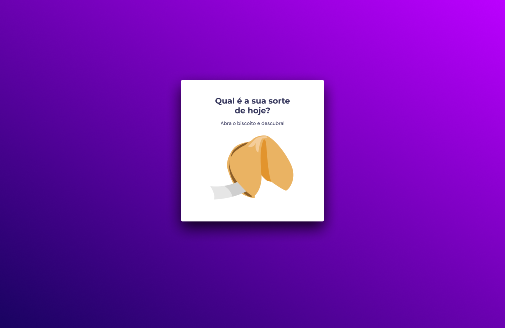

<h1 align="center"> BISCOITO DA SORTE</h1>

 Projeto feito inteiramente para RocketSeat

  

## TEMAS
Nesse projeto foram utilizados vários temas:

- Estrutura de dados HTML
- Animações com CSS
- Funções no Javascript
- Manipulação da DOM
- Biblioteca JS Math()
- Funções *callback*
- Arrays

## Projeto 

A aplicação do biscoito da sorte consiste em ao clicar no biscoito ele gera uma frase motivacional aleatória.

- Caso queira acessar o projeto, clique no link abaixo: 

  [Fortune cookie](https://math3usferreira.github.io/Fortune-cookie)

  

---

by ROCKETSEAT

[Conheça nossa comunidade.](https://discord.gg/rocketseat)
